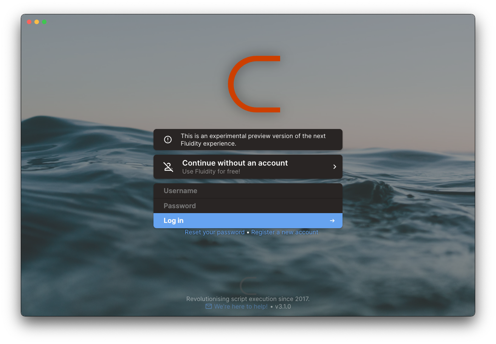
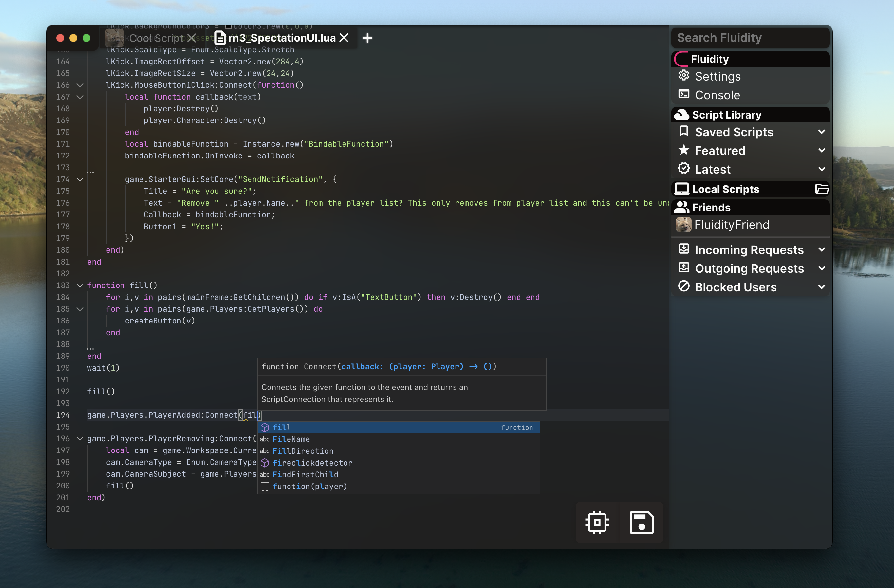
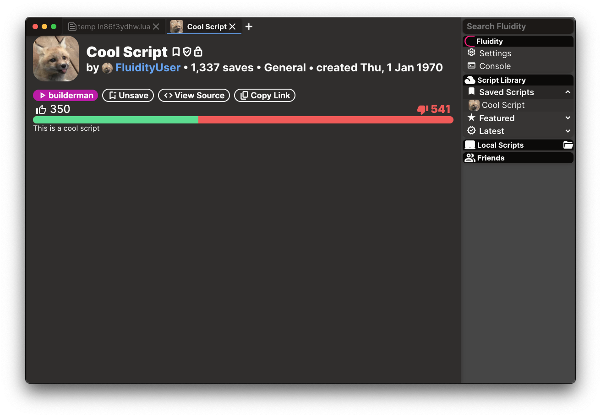
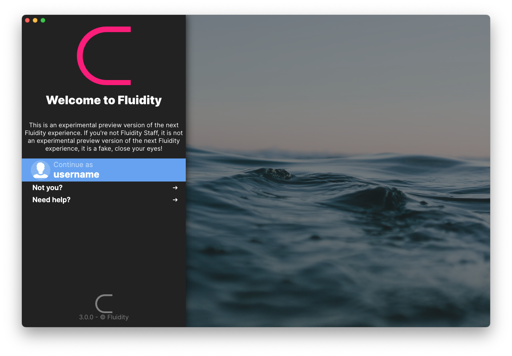
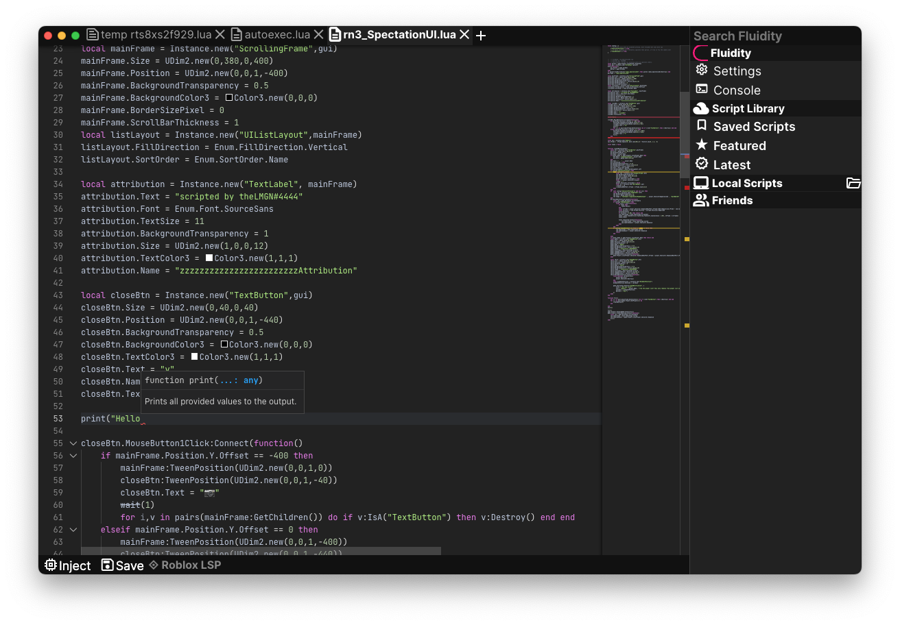
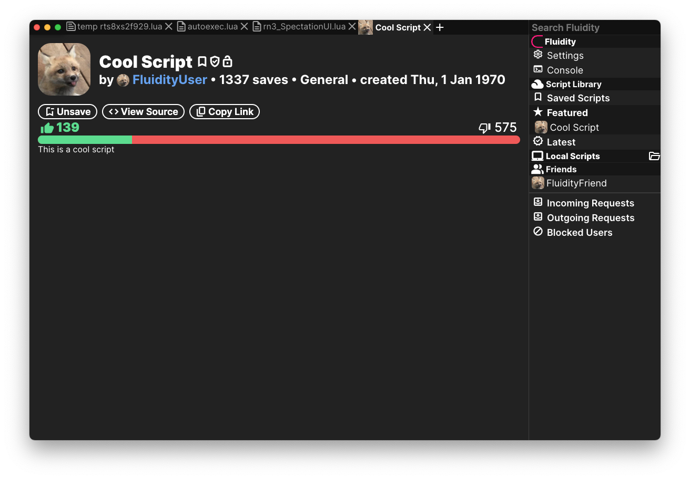

# Fluidity (archived, 2022/23)

was an attempt to make a product have less of the worst code the world had ever seen. Unfortunately, due to external factors, this new version got released.

The majority of the code in this project was written in 2022, with a partial refactor & facelift ('Fluidity Neue') in August 2023.

## Screenshots
### Neue

### Original

## Concepts (April 2022)

